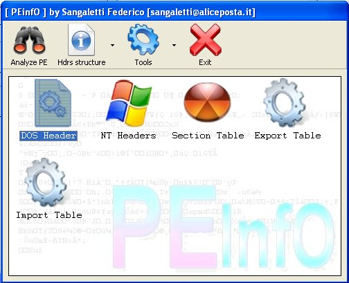



## PEInfO

### Description

This app show the most important information about a PE: headers, imports, exports, ecc...

It's coded only in VB and uses only OpenFile,SetFilePointer,ReadFile API.

I think it's a great programming stuff for advanced programmers.
 
### More Info
 

             |
---                |---
**Submitted On**   |2005-09-24 14:59:56
**By**             |[Sangaletti Federico](https://github.com/Planet-Source-Code/PSCIndex/blob/master/ByAuthor/sangaletti-federico.md)
**Level**          |Advanced
**User Rating**    |4.8 (24 globes from 5 users)
**Compatibility**  |VB 5\.0, VB 6\.0
**Category**       |[Complete Applications](https://github.com/Planet-Source-Code/PSCIndex/blob/master/ByCategory/complete-applications__1-27.md)
**World**          |[Visual Basic](https://github.com/Planet-Source-Code/PSCIndex/blob/master/ByWorld/visual-basic.md)
**Archive File**   |[PEInfO1935569262005\.zip](https://github.com/Planet-Source-Code/sangaletti-federico-peinfo__1-62689/archive/master.zip)

